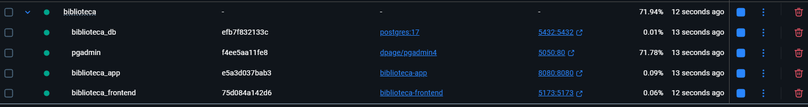

# Executando o Sistema

Este guia descreve como executar a aplicação e seus serviços utilizando Docker e Docker Compose, ou executando cada projeto individualmente.

## Links Principais de Acesso

Após inicializar o sistema, você pode acessar os seguintes serviços:

### **Links Essenciais:**
- **API da Aplicação:** [http://localhost:8080](http://localhost:8080)
- **Documentação (Swagger):** [http://localhost:8080/swagger-ui.html](http://localhost:8080/swagger-ui.html)
- **Frontend da Aplicação:** [http://localhost:5173](http://localhost:5173)
- **pgAdmin (Gerenciador do Banco):** [http://localhost:5050](http://localhost:5050)

---

## Execução com Docker (Recomendado)

### Pré-requisitos

- [Docker](https://docs.docker.com/get-docker/)
- [Docker Compose](https://docs.docker.com/compose/install/)
### Imagem dos containers após rodar:

### 1. Iniciar os Contêineres

Abra um terminal na raiz do projeto e execute o seguinte comando para construir a imagem da aplicação e iniciar todos os serviços em segundo plano:
```bash
docker-compose up
```

### 2. Acessar os Serviços

Após a inicialização, os seguintes serviços estarão disponíveis:

- **API da Aplicação:** [http://localhost:8080](http://localhost:8080)
- **Documentação (Swagger):** [http://localhost:8080/swagger-ui.html](http://localhost:8080/swagger-ui.html)
- **pgAdmin (Gerenciador do Banco):** [http://localhost:5050](http://localhost:5050)
    - **E-mail:** `admin@admin.com`
    - **Senha:** `admin`
      
- **O frontend estará disponível em:** [http://localhost:5173](http://localhost:5173)

### 3. Parar os Contêineres

Para parar todos os serviços, execute o comando abaixo no mesmo terminal:

```bash
docker-compose down
```
### 4. Configuração Manual do pgAdmin (Opcional)

Se desejar usar o pgAdmin localmente:

1. Baixe e instale o [pgAdmin](https://www.pgadmin.org/download/)
2. Configure uma nova conexão com os dados do seu banco PostgreSQL local
3. Use as credenciais do banco que você criou anteriormente

---

##  Banco de Dados e Liquibase

Este projeto utiliza o **PostgreSQL** como sistema de gerenciamento de banco de dados.

Para garantir que o esquema do banco de dados esteja sempre consistente e atualizado com a versão da aplicação, utilizamos o **Liquibase**.

### O que é o Liquibase?

O Liquibase é uma ferramenta de código aberto para controle de versão de banco de dados. Ele permite que você gerencie e aplique alterações no esquema do seu banco de dados (como criar tabelas, adicionar colunas, etc.) de forma programática e controlada.

### Como funciona neste projeto?

1. **Changelogs:** As alterações do banco de dados são definidas em arquivos de `changelog` (geralmente em formato XML, YAML ou SQL), localizados no diretório de recursos da aplicação.
2. **Inicialização:** Quando a aplicação é iniciada, o Liquibase verifica o estado atual do banco de dados.
3. **Aplicação das Mudanças:** Ele compara o estado do banco com os `changelogs` e aplica automaticamente quaisquer alterações pendentes.

Isso automatiza o processo de migração do banco de dados, eliminando a necessidade de executar scripts SQL manualmente e garantindo que o ambiente de desenvolvimento, teste e produção estejam sempre sincronizados.

---

##  Solução de Problemas

### Problemas Comuns

- **Porta já em uso:** Verifique se as portas 8080, 5173 e 5050 não estão sendo usadas por outros processos
- **Erro de conexão com banco:** Verifique se o PostgreSQL está rodando e as credenciais estão corretas
- **Dependências do npm:** Execute `npm install` novamente se houver problemas com as dependências do frontend

## Execução sem Docker
Se você preferir executar o sistema sem Docker, siga estas instruções:
### Pré-requisitos
- [Java Development Kit (JDK) 21](https://www.oracle.com/java/technologies/downloads/)
- [Maven](https://maven.apache.org/download.cgi)
- [PostgreSQL](https://www.postgresql.org/download/)
- [Node.js](https://nodejs.org/en/download/)
- [npm](https://www.npmjs.com/get-npm) (incluído com o Node.js)

### 1. Configurando o Banco de Dados
1. Instale o PostgreSQL seguindo as instruções oficiais para seu sistema operacional
2. Crie um banco de dados para a aplicação:
``` sql
   CREATE DATABASE biblioteca;
```
3. 1. Crie um usuário para acessar o banco (ou use um existente):
``` sql
   CREATE USER biblioteca_user WITH PASSWORD 'sua_senha';
   GRANT ALL PRIVILEGES ON DATABASE biblioteca TO biblioteca_user;
```
### 2. Configurando e Executando o Backend
1. Clone o repositório e navegue até a pasta raiz do projeto
2. Configure as propriedades do banco de dados no arquivo `src/main/resources/application.properties`:
``` properties
   spring.datasource.url=jdbc:postgresql://localhost:5432/biblioteca
   spring.datasource.username=biblioteca_user
   spring.datasource.password=sua_senha
```
1. Compile e execute o backend:
``` bash
   mvn clean install
   mvn spring-boot:run
```
1. O backend estará disponível em [http://localhost:8080](http://localhost:8080)

### 3. Configurando e Executando o Frontend
1. Navegue até a pasta `frontend`
2. Com o node instalado e pnpm instalado, instale as dependências:
``` bash
   pnpm install
```
1. Inicie o servidor de desenvolvimento:
``` bash
   pnpm run dev
```
1. O frontend estará disponível em [http://localhost:5173](http://localhost:5173)

### 4. Acessando a Documentação da API
A documentação Swagger estará disponível em [http://localhost:8080/swagger-ui.html](http://localhost:8080/swagger-ui.html)
